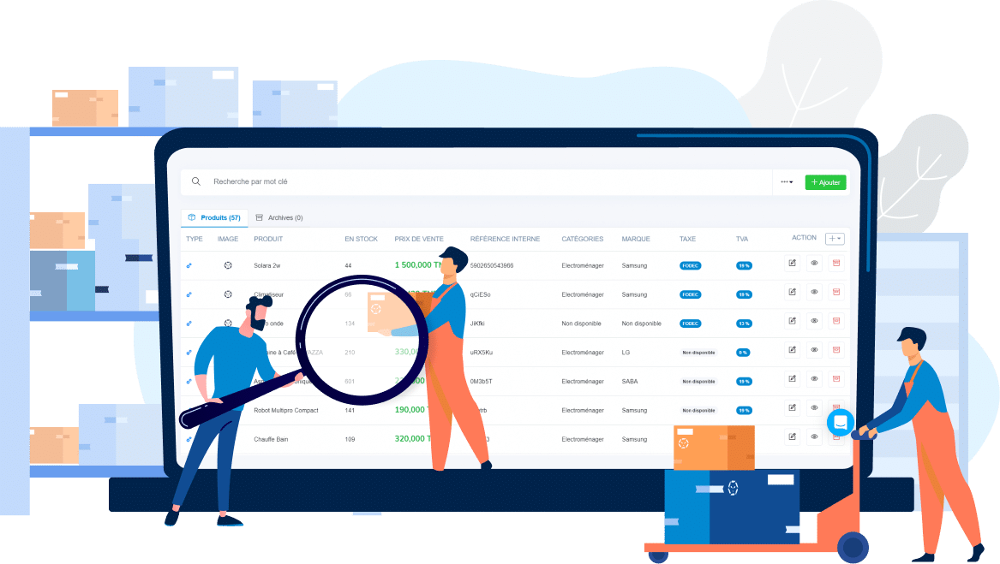

# 🏢 Gestion de Stock - Application Flask Professionnelle

Une application web complète de gestion de stock avec Flask, SQLite et SQLAlchemy. Système complet de suivi des mouvements, alertes de stock et dashboard intuitif.

## 📋 Table des matières

- [Caractéristiques](#caractéristiques)
- [Prérequis](#prérequis)
- [Installation](#installation)
- [Utilisation](#utilisation)
- [Structure du projet](#structure-du-projet)
- [Routes disponibles](#routes-disponibles)
- [Architecture](#architecture)

## ✨ Caractéristiques

### Fonctionnalités Principales
- **📊 Dashboard avec KPI**: Affichage en temps réel des statistiques
  - Nombre total de produits
  - Total du stock en unités
  - Ruptures de stock (critique)
  - Stock faible (avertissement)
  - Mouvements des 30 derniers jours
  - Alertes actives

- **📦 Gestion des Produits (CRUD Complet)**
  - Ajouter de nouveaux produits
  - Modifier les informations
  - Consulter les détails
  - Supprimer un produit
  - Chaque produit a: SKU, description, stock, seuil d'alerte

- **📤 Gestion des Mouvements de Stock**
  - Enregistrer des entrées (achats, retours, etc.)
  - Enregistrer des sorties (ventes, casses, etc.)
  - Sélection rapide des motifs courants
  - Historique complet avec pagination
  - Filtrage par produit

- **🚨 Système d'Alertes Intelligent**
  - Alertes de rupture de stock (critical)
  - Alertes de stock faible (warning)
  - Gestion des alertes résolues/actives
  - Page dédiée de gestion des alertes

- **💾 Persistance des Données**
  - SQLite pour stockage local
  - Migrations automatiques avec SQLAlchemy
  - Relations entre tables avec cascades

- **🎨 Interface Utilisateur Professionnelle**
  - Bootstrap 5 responsive
  - Design moderne avec gradients
  - Icônes Bootstrap Icons
  - Responsive sur mobile/tablette/desktop
  - Messages flash pour confirmations

- **🔒 Sécurité**
  - Protection CSRF avec Flask
  - Validation des données côté serveur
  - Gestion des erreurs 404 et 500
  - SQL injection protection (SQLAlchemy ORM)

## 🛠 Prérequis

- **Python** 3.10+
- **pip** (gestionnaire de paquets Python)
- **Internet** pour télécharger les dépendances

Versions recommandées des dépendances:
- Flask 3.0.0
- Flask-SQLAlchemy 3.1.1
- SQLAlchemy 2.0.23
- python-dotenv 1.0.0

## 📥 Installation

### Étape 1: Cloner ou télécharger le projet
```bash
cd c:\mes vs code\gestionmagasin
```

### Étape 2: Créer un environnement virtuel (recommandé)
```bash
python -m venv venv
# Windows
venv\Scripts\activate
# macOS/Linux
source venv/bin/activate
```

### Étape 3: Installer les dépendances
```bash
pip install -r requirements.txt
```

### Étape 4: Lancer l'application
```bash
python app.py
```

L'application sera accessible à `http://127.0.0.1:5000`

### Étape 5: Accéder au dashboard
Ouvrez votre navigateur web et allez à:
```
http://127.0.0.1:5000/
```

## 📖 Utilisation

### Ajouter un Produit
1. Cliquez sur "Ajouter Produit" dans la navbar
2. Remplissez le formulaire:
   - **Nom du produit** (obligatoire, unique)
   - **Code SKU** (obligatoire, unique)
   - **Description** (optionnel)
   - **Stock Initial** (nombre d'unités)
   - **Seuil d'alerte** (quantité minimale)
3. Cliquez "Ajouter le Produit"

### Enregistrer un Mouvement de Stock
1. Depuis le dashboard, cliquez le bouton **Mouvement** du produit
2. Sélectionnez le type: **Entrée** ou **Sortie**
3. Entrez la **Quantité**
4. Choisissez le **Motif** (ex: Vente, Achat, Retour, etc.)
5. Cliquez "Enregistrer Mouvement"

Le système met à jour automatiquement le stock et crée une alerte si nécessaire.

### Consulter l'Historique
1. Cliquez sur "Mouvements" dans la navbar
2. Filtrez par produit si désiré
3. Utilisez la pagination pour naviguer

### Gérer les Alertes
1. Cliquez sur "Alertes" dans la navbar
2. Consultez les alertes actives
3. Cliquez "Résoudre" pour marquer comme traitée
4. Consultez l'historique des alertes résolues

## 📁 Structure du Projet

```
gestionmagasin/
├── app.py                          # Application Flask principale
├── models.py                       # Modèles SQLAlchemy
├── requirements.txt                # Dépendances Python
├── inventory.db                    # Base de données SQLite
├── templates/                      # Templates HTML/Jinja2
│   ├── index.html                 # Dashboard principal
│   ├── add_product.html           # Formulaire ajout produit
│   ├── view_product.html          # Détails produit
│   ├── edit_product.html          # Formulaire modification
│   ├── movement.html              # Formulaire mouvement
│   ├── movements.html             # Historique mouvements
│   ├── alerts.html                # Gestion des alertes
│   ├── 404.html                   # Erreur 404
│   └── 500.html                   # Erreur 500
└── .venv/                          # Environnement virtuel (optionnel)
```

## 🛣️ Routes Disponibles

### Pages Principales
| Route | Méthode | Description |
|-------|---------|-------------|
| `/` | GET | Dashboard principal avec KPIs |
| `/product/add` | GET, POST | Ajouter un produit |
| `/product/<id>` | GET | Voir détails produit |
| `/product/<id>/edit` | GET, POST | Modifier un produit |
| `/product/<id>/delete` | GET | Supprimer un produit |
| `/product/<id>/movement` | GET, POST | Enregistrer mouvement |
| `/movements` | GET | Historique mouvements (paginé) |
| `/alerts` | GET | Gestion des alertes |
| `/alert/<id>/resolve` | GET | Résoudre une alerte |

### API JSON (optionnel)
| Route | Méthode | Description |
|-------|---------|-------------|
| `/api/dashboard/stats` | GET | Statistiques dashboard JSON |
| `/api/product/<id>/stock` | GET | Info stock produit JSON |

### Gestion d'Erreurs
| Route | Description |
|-------|-------------|
| `/404` | Page non trouvée |
| `/500` | Erreur serveur |

## 🏗️ Architecture

### Modèle de Données

#### Product (Produit)
```python
- id (PK)
- name (String, unique)
- sku (String, unique)
- description (Text)
- current_stock (Integer)
- threshold (Integer)
- created_at (DateTime)
- updated_at (DateTime)
```

#### Movement (Mouvement)
```python
- id (PK)
- product_id (FK → Product)
- quantity_change (Integer, +/- unités)
- movement_type (String: 'IN' ou 'OUT')
- reason (String)
- recorded_by (String)
- timestamp (DateTime)
```

#### Alert (Alerte)
```python
- id (PK)
- product_id (FK → Product)
- alert_type (String: 'CRITICAL' ou 'WARNING')
- message (Text)
- is_resolved (Boolean)
- created_at (DateTime)
```

### Stack Technique

**Backend:**
- Flask 3.0.0 - Framework web
- SQLAlchemy 2.0.23 - ORM
- SQLite - Base de données
- Jinja2 - Template engine

**Frontend:**
- HTML5 - Structure
- Bootstrap 5.3.3 - Framework CSS
- Bootstrap Icons - Icônes
- CSS3 - Styling

**Architecture:**
- Pattern MVC (Model-View-Controller)
- RESTful routes
- Database abstraction layer (SQLAlchemy)
- Template-based rendering

## 🔧 Configuration

### Variables d'Environnement (optionnel)
Créez un fichier `.env` à la racine du projet:
```env
FLASK_ENV=development
FLASK_DEBUG=True
SECRET_KEY=votre_cle_secrete
```

### Mode Production
Pour passer en production:
1. Modifiez `app.py`, ligne 330: `app.run(debug=False)`
2. Utilisez un serveur WSGI: Gunicorn, uWSGI, etc.
3. Configurez un proxy inverse: Nginx, Apache, etc.

## 📊 Exemples d'Utilisation

### Scenario 1: Gérer un Achat de Stock
1. Ajouter un nouveau produit "Laptop Dell XPS"
2. Stock initial: 0, Seuil: 5
3. Recevoir 10 unités
4. Aller sur le produit → Cliquer "Mouvement"
5. Sélectionner "Entrée" → Quantité 10 → Motif "Achat fournisseur"
6. Alert résolue automatiquement

### Scenario 2: Gérer une Vente
1. Sélectionner produit en stock
2. Cliquer "Mouvement"
3. Sélectionner "Sortie" → Quantité 3 → Motif "Vente client"
4. Stock réduit de 3 unités
5. Alerte créée si stock < seuil

### Scenario 3: Consulter l'Historique
1. Cliquer "Mouvements"
2. Filtrer par produit si désiré
3. Consulter entrées/sorties
4. Dates, motifs, responsables

## 🐛 Dépannage

### Erreur: "no such column"
**Cause**: Ancienne base de données avec ancien schéma
**Solution**: Supprimer `inventory.db` et redémarrer l'app

### Erreur: "Port 5000 en utilisation"
**Cause**: Flask tourne déjà ou autre app utilise le port
**Solution**: 
```bash
# Arrêter le processus Flask
# Ou modifier le port dans app.py, ligne 330:
app.run(port=5001)
```

### Erreur: "Module not found"
**Cause**: Dépendances non installées
**Solution**:
```bash
pip install -r requirements.txt
```

## 📝 Fichiers Clés

### `app.py` (325 lignes)
- Configuration Flask
- Routes CRUD produits
- Routes mouvements
- Routes alertes
- Fonctions utilitaires
- Gestion erreurs

### `models.py` (163 lignes)
- Classe Product
- Classe Movement
- Classe Alert
- Relations SQLAlchemy
- Fonctions métier

### `templates/` (8 fichiers, ~60 KB)
- Interface responsive
- Bootstrap 5 moderne
- Formulaires sécurisés
- Messages flash
- Pagination

### `requirements.txt`
- Flask 3.0.0
- Flask-SQLAlchemy 3.1.1
- SQLAlchemy 2.0.23
- python-dotenv 1.0.0

## 📄 Licence

Projet créé à titre professionnel.

## 👨‍💻 Support

Pour toute question ou bug:
1. Vérifiez les logs Flask (console)
2. Consultez la page d'erreur Werkzeug
3. Vérifiez le schéma de la base de données
4. Réinstallez les dépendances

## 🎯 Roadmap Futures

- [ ] Authentification utilisateurs
- [ ] Rôles et permissions
- [ ] Export en PDF/CSV
- [ ] Graphiques de tendances
- [ ] Notifications par email
- [ ] Codes barres/QR codes
- [ ] Multi-magasins
- [ ] Prévisions de stock (IA)
- [ ] Intégration API externes
- [ ] Mode hors ligne

---

**Créé avec ❤️ en utilisant Flask, SQLAlchemy et Bootstrap**

Dernière mise à jour: 2024
